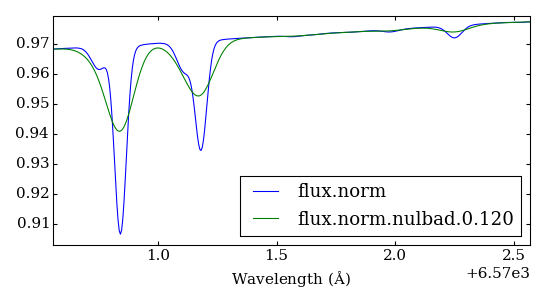
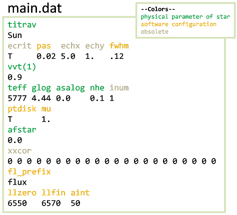
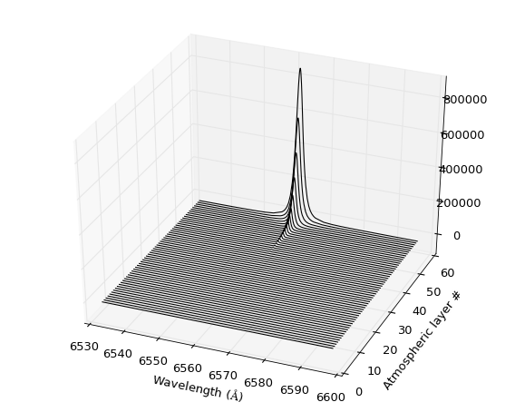

```
This directory

PFANT
├── fortran . Fortran source code and binaries
├── data .... Some stellar data, spectral lines etc.
└── doc ..... Graphic material made in PowerPoint, GIMP etc.
```

# Welcome

# PFANT Manual

# Table of contents

  1. [Introduction](#S1)
  2. [Installation](#S2)
  3. [Operation](#S3)
  4. [Reference](#S4)
  5. [Other topics](#S5)
  6. [Links](#S6)
  7. [References](#S7)

## <a name=S1></a>1 Introduction

PFANT is a stellar spectral synthesis software written in Fortran.

The development started with F Spite _et al._ in France in the year of 1967 (Figure 1).

```
 |
 | 1967 -- FANTÔME -- by F Spite et al.
 | 1982 -- FANTOMOL -- B Barbuy included the computation of molecular lines,
 |         dissociatipon equilibrium.
 | 2003 -- PFANT -- M-N Perrin: large wavelength coverage,
 |         inclusion or hydrogen lines.
 | 2015 -- J Trevisan: conversion of source code to Fortran 2003.
t|
 V
```
Figure 1 - PFANT timeline [(Coelho et al. 2005)](#R1)

# 2 <a name=S2></a>Installation

To use PFANT, you will need to:

1. Download files
2. Compile the Fortran source code
3. Add `PFANT/fortran/bin` to your PATH
4. Install **pyfant** (Python interface) (http://github.com/trevisanj/pyfant)

:notes: PFANT is platform-independent (it should work no any system if you can install the GNU Fortran Compiler),
however only Debian-based Linux system is "supported" in the following instructions. Windows users will find some tips
in a specific section below.


This section will take you through these steps.


### 2.1 Installing required software

#### 2.1.1 Standalone applications

Please install the following standalone applications on your system (no pain except for gfortran and make on Windows (see below)):
  - gfortran >= 4.6 (theoretical; tested with 4.8 only)
  - make


### 2.1 Download files

#### 2.1.1 Clone the GitHub repository:

```shell
git clone https://github.com/trevisanj/PFANT
```

This will create a directory named PFANT on your disk.

#### 2.1.2 Extra file

There is an additional data file that needs to be downloaded from a different
location, because it is too big to be stored on GitHub (241 MB > 100 MB). To get file, either:

(a) go to directory `PFANT/data/common` and run `get-grid.moo.sh`, or
  
(b) download it from [this location](https://docs.google.com/uc?export=download&confirm=4o6l&id=0B8m8GNLFiaewejd6dmJ6MW1pX2c)
(or [this location](https://drive.google.com/file/d/0B8m8GNLFiaewejd6dmJ6MW1pX2c/view))
and save it as _PFANT/data/common/grid.moo_

:notes: File _grid.moo_ contains a 3D grid of MARCS (http://marcs.astro.uu.se/) atmospheric models with opacities included.

### 2.2 Compiling the Fortran source code.

Enter the following on your console to compile the Fortran source code:

```shell
cd PFANT
cd fortran
./make-linux.sh
```

This should create four executable binaries inside the directory _PFANT/fortran/bin_: 
`innewmarcs`, `hydro2`, `pfant`, `nulbad`.

### 2.3 Setting the paths

Depending on which shell your system uses, try one of the following:

Bash shell:
```shell
./add-path.py --bash
```

Tcsh shell:
```shell
./add-path.py --tcsh
```

This will automatically apply the path settings to your _home/.bashrc_ or _home/.cshrc_.


:notes: If the above does not work for you, manually add _PFANT/fortran/bin_ to your system path.


### 2.5 Tips for windows users

#### 2.5.1 gfortran and make on Windows

MinGW (http://sourceforge.net/projects/mingw/files/) is a convenient way to install the GNU Fortran compiler on Windows.

After installed, MinGW has its own package manager, named
"MinGW Installation Manager". There, you will need to install at least the following packages:
`mingw-developer-toolkit`, `mingw32-base`, `mingw32-gcc-fortran`, `msys-base`.


#### 2.5.2 Compiling the source code on Windows

The source can be compiled using the CodeBlock Fortran IDE. For more information,
please visit [the Fortran source code README](fortran/README.md). The _PFANT/fortran_ forder contains a CodeBlocks
project named _PFANT-windows.cbp_


## <a name=S3></a>3 Command-line operation

This section uses the `pyfant` Python package,
which is freely available at http://github.com/trevisanj/pyfant. Please install it to follow this tutorial.


**Aims for this tutorial:**
  - calculate a synthetic spectrum;
  - convolve with Gaussian functions of varying full-width-at-half-maximum (FWHM);
  - visualize results.

### 3.1 Short story

Here is the full command sequence:

```shell
mkdir mystar
cd mystar
copy-star.py
link.py
run4.py
plot-spectra.py --ovl flux.norm flux.norm.nulbad.0.120 
```

:notes: If you choose star Mu-Leo, run `run4.py --allow true` to bypass the fact that its
metallicity if outside the atmospheric model grid provided

### 3.2 Long story

#### 3.2.1 Create a new directory

```shell
mkdir mystar
cd mystar
```

#### 3.2.2 Gather input data

Input data consists of:
  1. stellar parameters (temperature, chemical abundances etc.) and running settings
     (_e.g._, calculation wavelength interval);
  2. star-independent physical data: line lists, atmospheric model grid, partition
     functions etc. that are less likely to be modified.
     We refer to these as "common" data.

##### 3.2.2.1 Stellar data and running settings

The following displays a menu allowing you to choose among a few stars:

```shell
copy-star.py
```

After running this, the following files will be copied into the _mystar_ directory:
  - *main.dat*: main configuration
  - *abonds.dat*: chemical abundances
  
#### 3.2.2.2 Common data

For these data, we will create links instead of copying the files, as the files are big 
and/or unlikely to change:

```shell
link.py
```

The following links that should appear in your directory now:
  - *absoru2.dat*
  - *atoms.dat*
  - *grid.moo*
  - *hmap.dat*
  - *molecules.dat*
  - *partit.dat*
  
 
#### 3.3 Spectral synthesis pipeline

Spectral synthesis involves a few steps,
as shown Figure 2,
and described in the next subsections.

```
+-------------------+   +----------------+   +-----------+   +----------+
| innewmarcs        |   | hydro2         |   | pfant     |   | nulbad   |
| ==========        |   | ======         |   | =====     |   | ======   |
|   interpolate the |   |         create |   | calculate |   | convolve |
|       atmospheric |-->| hydrogen lines |-->| synthetic |-->|     with |
|             model |   |       profiles |   |  spectrum |   | Gaussian |
+-------------------+   +----------------+   +-----------+   +----------+
```
Figure 2 - PFANT spectral synthesis pipeline showing the Fortran program names
and what they do.

#### 3.3.1 Interpolate the stellar atmospheric model

This step takes a 3D grid of atmospheric models and interpolates a new model
given a certain point (temperature x gravity x metallicity) contained within the
limits of the grid.

```shell
innewmarcs
```

will create two files: _modeles.mod_ and _modeles.opa_. 

#### 3.3.2 Create hydrogen lines profiles

```shell
hydro2
```

will create files such as: _thalpha_ (Figure 8), _thbeta_, _thgamma_ etc.

#### 3.3.3 Calculate synthetic spectrum

```shell
pfant
```

creates files _flux.norm_, _flux.spec_, _flux.cont_,
respectively: normalized, un-normalized, continuum spectrum.

To visualize these files:

```shell
plot-spectra.py flux.spec flux.cont flux.norm
```

will open a plot window (Figure 3).


Figure 3 -- plots of three files generated by `pfant`

#### 3.3.4 Convolve synthetic spectrum with Gaussian function

The following will take the normalized spectrum from the previous step and convolve it
with a Gaussian function of FWHM=0.12 :

```shell
nulbad
```

creates file _flux.norm.nulbad.0.120_

:bulb: You can change the FWHM using option `--fwhm`


#### 3.3.4 Plot spectra


```shell
plot-spectra.py --ovl flux.norm flux.norm.nulbad.0.120 
```

opens a plot window where one can see how the spectrum looks before and after the convolution (Figure 4).



Figure 4 -- plot comparing spectra without and after convolution with Gaussian function (FWHM=0.12).


#### 3.3.6 Running the four calculation steps at once

The script `run4.py` is provided for convenience. 
The following is almost equivalent to steps 3.2.1-3.2.4:

```shell
run4.py --fwhm 0.12
```

`run4.py` creates a directory named _session-&lt;n&gt; where it saves temporary
files. It may be useful to check the log files in this directory if you encounter any
errors during program execution.

### 3.3.6 Where you can find more information

:book: **Description of stellar parameters, running settings, command-line options:** run `x.py`
and navigate through the fields in Tabs 1 and 3. As you navigate, documentation for
the current field will be displayed at the bottom of the window.

:book: Call a program with "--help" option, _e.g._, `pfant --help`.

:book: **other _README.md_ files** can be found in other PFANT subdirectories.

:book: `programs.py` lists all Fortran/Python programs.
 
:book: The Fortran source code

:book: Also check the pyfant tutorial(s) at http://github.com/trevisanj/pyfant

  
## 4 <a name=S4></a>Reference section

This section contains a more complete description of the PFANT pipeline and the files and file types involved.

### 4.1 Spectral synthesis pipeline


```
                    +---------------------------+---------------------main.dat
                    |                           |                        |
                    v                           v                        |
 grid.mod     +----------+                  +------+                     |
      or ---->|innewmarcs|-->modeles.mod--->|hydro2|<----------+         |
 grid.moo     +----------+         |        +------+           |         |
                                   |            |              |         |
                                   |            v              |         |
                                   |         thalpha           |         |
                                   |         thbeta        absoru2.dat   |
                                   |         thgamma       hmap.dat      |
                                   |         thdelta           |         |
                                   |         thepsilon         |         |
                                   |            |              |         |
                    abonds.dat     |            v              |         |
                    dissoc.dat     +-------->+-----+           |         |
                     atoms.dat               |pfant|<----------+         |
                 molecules.dat ------------->+-----+<--------------------+
                    partit.dat                  |                        |
                                                v                        |
                                            flux.norm                    |
                                            flux.spec                    |
                                            flux.cont                    |
                                                |                        |
                                                v                        |
                                             +------+                    |
                                             |nulbad|<-------------------+
                                             +------+
                                                |
                                                v
                                         flux.norm.nulbad.<fwhm>
```
Figure 5 - Spectral synthesis pipeline - Fortran programs (boxes) and their 
input/output files.


### 4.2 Input/output data files

The different file types in the pipeline will be explained in the next subsections.
 
#### 4.2.1 Stellar data and running settings

Table 2 -- stellar and running settings data files. The "--options" column shows the
command-line options that can be used to change the name for a particular file, _e.g._,
`run4.py --fn_main main-other.dat`.

 Default name     | --option    | Description                    
------------------|-------------|----------------------------------------------------
_main.dat_        | --fn_main   | main configuration file containing all stellar parameters except abundances (Figure 6).
_abonds.dat_      | --fn_abonds | chemical abundances
_dissoc.dat_      | --fn_dissoc | dissociation equilibrium data. This file is optional, and can be created using `abed.py` if needed.



Figure 6 - representaion of a file _main.dat_. The black color shows the characters
that are the actual parts of the file.


#### 4.2.2 Common data files

Table 3 -- Common data files.

 Default name     | --option       | Description                    
------------------|----------------|---------------------------------------------------
_absoru2.dat_     | --fn_absoru2   | absorption info for continuum calculation.
_atoms.dat_       | --fn_atoms     | atomic line list
_molecules.dat_   | --fn_molecules | molecular line list
_hmap.dat_        | --fn_hmap      | hydrogen line list
_partit.dat_      | --fn_partit    | partition functions
_grid.mod_ or     | --fn_modgrid   | MARCS atmospheric model grid (models only).
                  |                | Created using `create-grid.py --mode modbin` from files _newnew*.mod_
_grid.moo_        | --fn_moo       | MARCS atmospheric model grid (models with opacities) (Figure 8).
                  |                | Created using `create-grid.py --mode opa` from a bulk of models downloaded from the MARCS website


Figure 8 -- 3D scatterplot showing points of (teff, glog, [Fe/H]) space where
there are atmospheric models in grid.moo. The uppermost point are the Sun coordinates.

#### 4.2.3 Files created by the Fortran programs

##### 4.2.3.1 Files created by `innewmarcs`

Table 4 -- Files created by `innewmarcs`

 Default name     | --option     | Description                    
------------------|--------------|---------------------------------------------------
_modeles.mod_     | --fn_modeles | atmospheric model (binary file) (Figure 8A)
_modeles.opa_     | --fn_opa     | atmospheric model: opacities (MARCS ".opa" format) (Figure 8B,8C)


Figure 8 -- Atmospheric model information (Sun).
**(A)** data in file modeles.mod;
**(B)**, **(C)** data in modeles.opa  

`innewmarcs` creates two separate files (Table 4). They are created separately for
historical reasons. _modeles.opa_ follows the same structure of ".opa" files downloaded from
the MARCS website. _modeles.mod_ does **not** follow the same structure of MARCS ".mod" files.
Figure 8 exemplifies the information contained in these files. 

##### 4.2.3.2 Files created by `hydro2`

`hydro2` creates a series of files named _thalpha_ (Figure 9), _thbeta_, _thgamma_, 
_thdelta_, _thepsilon_ etc (the series of hydrogen lines is given in _hmap.dat_).



Figure 9 -- Example of H-alpha line profile calculated by `hydro2`.  

These files will be 

##### 4.2.3.3 Files created by `pfant`

Table 5 - Files created by `pfant`

 Default name     | Description                    
------------------|--------------------------------------------------
_flux.norm_       | normalized flux
_flux.spec_       | un-normalized flux (multiplied by 10**5)
_flux.cont_       | continuum flux (multiplied by 10**5)


Figure 10 - plots showing three `pfant` output files for the [4000, 7000] angstrom region: 
calculated spectrum; continuum; normalized spectrum.

The common prefix "flux" can be changed in file _main.dat_ to give a set of files
with different names.

##### 4.2.3.4 Files created by `nulbad`

`nulbad` creates a file whose name by default is the full input file name with the FWHM
added with three decimal places. For example,
 
```shell
nulbad --fwhm 1.2
```

creates a file named _flux.norm.nulbad.1.200_.
 
To change this, use option "--fn_cv", for example,

```shell
nulbad --fwhm 1.2 --fn_cv another-name
```


## 5 <a name=S5></a> Miscellanea how-to

### 5.1 Continuous opacities: selecting between PFANT and MARCS coefficients

The following is now the default mode of operation:

```shell
innewmarcs --opa T
```

```shell
pfant --opa T --abs T --sca T --absoru F
```

Meaning:

```
--opa T ...... switches on MARCS opacities
               (may be of two types: absorption and scattering)
--abs T ...... switches on MARCS absorption
--sca T ...... switches on MARCS scattering
--absoru F ... switches off PFANT internal calculation
```

For `innewmarcs`, "--opa T" causes the creation of an additional file _modeles.opa_
besides _modeles.mod_.

Accordingly, `pfant` will require these two files in order to run.

**Operating without MARCS opacities**

```shell
innewmarcs --opa F
```

```shell
pfant --opa F --absoru T
```

**Adding PFANT and MARCS coefficients together**

```shell
pfant --opa T --absoru T
```


### 5.2 Converting "VALD3 extended" format atomic lines

The Vienna Atomic Line Database (VALD) is "a 
collection of atomic and molecular transition parameters of astronomical interest"
(http://vald.astro.uu.se/).


To convert from the "VALD3 extended" to a "PFANT atomic lines" file:

```shell
vald3-to-atoms.py <prefix>.vald3x
tune-zinf atoms-<prefix>-untuned.dat
```

This is done in two steps. The first step, `vald3-to-atoms.py` does the actual conversion
(which is quick) and saves a file, _e.g._, `atoms.dat`

The second step (which is time-consuming) is performed by `tune-zinf.py` and aims
to tune an important parameter used by the `pfant` Fortran binary.

It is recommended to use the tool `cut-atoms.py` to cut the file converted by
`vald3-to-atoms.py` to a wavelength region of interest before running `tune-zinf.py`.

For more information, see help for `vald3-to-atoms.py`, `tune-zinf.py`,
`cut-atoms.py` (call these scripts with `--help` option).


# 6 Links
  - [fortran/README.md](fortran/README.md) -- Fortran source code overview 
  - [pyfant/README.md](pyfant/README.md) -- Python layer overview


# 7 References

**(Coelho et al. 2005)**<a name=R1></a> Coelho, P., Barbuy, B., Meléndez, J., Schiavon, R. P., & Castilho, B. V. 
(2005). A library of high resolution synthetic stellar spectra from 300 nm to 
1.8${\ rm\ mu} $ m with solar and $\ alpha $-enhanced composition. Astronomy & 
Astrophysics, 443(2), 735-746.
