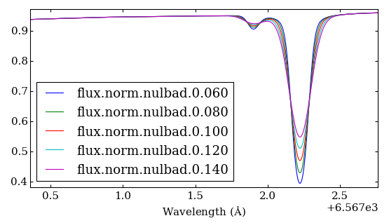

```
This directory

PFANT
├── art                     Graphic material made in PowerPoint, GIMP etc.
├── fortran                 Fortran source code and binaries
├── pyfant                  Python package and scripts                        
└── data                    Some stellar data, spectral lines etc.
```

# Welcome

# PFANT Manual

# Table of contents

  1. [Introduction](#S1)
  2. [Installation](#S2)
  3. [Operation](#S3)
  4. [Reference](#S4)
  5. [Other topics](#S5)

## <a name=S1></a>1 Introduction

PFANT is stellar spectral synthesis software written in Fortran.

The development started with F Spite et al. in France in the year of 1967 and has been upgraded since then (Figure 1).

```
 |
 | 1967 -- FANTÔME -- by F Spite et al.
 | 1982 -- FANTOMOL -- B Barbuy included the computation of molecular lines,
 |         dissociatipon equilibrium.
 | 2003 -- PFANT -- M-N Perrin: large wavelength coverage,
 |         inclusion or hydrogen lines.
 | 2015 -- J Trevisan: conversion of source code to Fortran 2003.
t|
 V
```
Figure 1 - PFANT timeline  

# 2 <a name=S2></a>Installation

PFANT is cross-platform, and all features have been tested on Windows and Linux.

To use PFANT, you will need to:

1. Install the software pre-requisites
2. Go to https://github.com/trevisanj/PFANT/releases and download the most recent release
3. Compile the Fortran source code
4. Add `PFANT/fortran/bin` and `PFANT/pyfant/scripts` to your PATH and add `PFANT/pyfant` to your PYTHONPATH

This section will take you through these steps.

### 2.1 Installing required software

Depending on your OS platform, you may have some of the following already installed.

#### 2.1.1 Standalone applications

  - gfortran >= 4.6
  - make
  - Python 2.7
  - pip

##### 2.1.1.1 Windows users: gfortran and make on Windows

MinGW (http://sourceforge.net/projects/mingw/files/) is a convenient way to install the GNU Fortran compiler on Windows.

After installed, MinGW has its own package manager, named
"MinGW Installation Manager". There, you will need to install at least the following packages:
`mingw-developer-toolkit`, `mingw32-base`, `mingw32-gcc-fortran`, `msys-base`.

#### 2.1.2 Python packages

Package name  | Possible way to install
------------- | ---
matplotlib    | apt-Linux: `sudo apt-get install python-matplotlib`
pyqt4         | apt-Linux: `sudo apt-get install python-qt4`
              | Windows: download Python 2.7 installer at https://riverbankcomputing.com/software/pyqt/download
fortranformat | All systems: `[sudo] pip install fortranformat`
astropy       | apt-Linux: `sudo apt-get install python-astropy`
              | All systems: `[sudo] pip install astropy`

**Linux users:** you may have to `sudo` your `pip` commands.


### 2.2 Downloading PFANT

  a. either go to https://github.com/trevisanj/PFANT/releases and download the most recent release, or

  b. clone the github repository: `git clone https://github.com/trevisanj/PFANT`

In either case, there should be a directory named PFANT on your drive now.

:zap: There is an additional data file that needs to be downloaded from a different
location, because it is too big to be stored on GitHub (> 100 MB).
Please download file `grid.moo` from [here]
(https://drive.google.com/file/d/0B8m8GNLFiaewY0J1YzRrbHBCbWs/view?usp=sharing)
and save it as `PFANT/data/common/grid.moo`.
This file contains a 3D grid of MARCS atmospheric models with opacities included.

### 2.3 Compiling the Fortran source code.

The source code has been successfully compiled using gfortran 4.8.

#### 2.3.1 Linux users

The code can be compiled using the [CBFortran IDE](fortran/README.md), or using the console:

```shell
cd PFANT
cd fortran
./make-linux.sh
```

#### 2.3.1 Windows users

The code can be compiled using the [CBFortran IDE](fortran/README.md).

### 2.4 Setting the paths

Add `PFANT/fortran/bin` and `PFANT/pyfant/scripts` to your PATH.

Add `PFANT/pyfant` to your PYTHONPATH.

#### 2.4.1 Linux users

Linux users may try the script `PFANT/add-paths.py`, which tries to automatically
apply the path settings by modifying your `home/.bashrc` or `home/.cshrc`:

Bash shell:
```shell
./add-paths.py --bash
```

Tcsh shell:
```shell
./add-paths.py --tcsh
```

## <a name=S3></a>3 Operation

Section 3 is a short tutorial that will take you through common operational steps.

**Aims for this tutorial**
  - calculate a synthetic spectrum;
  - convolve with Gaussian functions of different FWHMs;
  - visualize results.

### 3.1 Input data

Input data contists of:
  1. stellar parameters (temperature, chemical abundances etc.) and running settings (_e.g._, calculation wavelength interval);
  2. star-independent physical data: line lists, atmospheric model grid, partition functions etc. that are unlikely to be modified.
     We refer to these as "common" data.

First let's create a new directory:

```shell
mkdir mystar
cd mystar
```

#### 3.1.1 Stellar data and running settings

The following displays a menu allowing you to choose among a few stars:

```shell
copy-star.py
```

After running this, the following files will be copied into your local directory:
  - main.dat: main configuration
  - abonds.dat: chemical abundances
  
#### 3.2 Common data

For these data, we will create links instead of copying the files. This can be
done by running the following:

```shell
link.py
```
```
Create links to /home/[...]/PFANT/data/common (Y/n)? Y
.
.
.
```

The following links that should appear in your directory now:
  - absoru2.dat
  - atoms.dat
  - grid.moo
  - hmap.dat
  - molecules.dat
  - partit.dat
  
 
### 3.2 Spectral synthesis

Spectral synthesis involves a few steps, as shown in Figure 2.
These steps will be described in the next subsections.

```
+-------------------+   +----------------+   +-----------+   +----------+
| innewmarcs        |   | hydro2         |   | pfant     |   | nulbad   |
| ==========        |   | ======         |   | =====     |   | ======   |
|   interpolate the |   |         create |   | calculate |   | convolve |
|       atmospheric |-->| hydrogen lines |-->| synthetic |-->|     with |
|             model |   |       profiles |   |  spectrum |   | Gaussian |
+-------------------+   +----------------+   +-----------+   +----------+
```
Figure 2 - Summarized workflow showing the Fortran program names and what they do.

#### 3.2.1 Interpolate the stellar atmospheric model

```shell
innewmarcs
```

will create two files: modeles.mod and modeles.opa. 

#### 3.2.2 Create hydrogen lines profiles

```shell
hydro2
```

will create files such as: thalpha, thbeta, thgamma etc.

#### 3.2.3 Calculate synthetic spectrum

```shell
pfant
```

creates files flux.norm, flux.spec, flux.cont


#### 3.2.4 Convolve synthetic spectrum with Gaussian function

```shell
nulbad --fwhm 0.12
```

creates flux.norm.nulbad.0.120

```shell
plot-spectra.py --ovl flux.norm flux.norm.nulbad.0.120 
```

opens a plot window.

Now let's vary FWHM and plot the six different convolved spectra (Figure TODO).

```shell
nulbad --fwhm 0.06
nulbad --fwhm 0.08
nulbad --fwhm 0.10
nulbad --fwhm 0.12
nulbad --fwhm 0.14
plot-spectra.py --ovl flux.norm.nulbad.0.060 flux.norm.nulbad.0.080 flux.norm.nulbad.0.100 flux.norm.nulbad.0.120 flux.norm.nulbad.0.140
```



Figure TODO - plots showing zoomed spectra where the effects of different FWHMs
(0.06 to 0.14) for convolution with Gaussian can be contemplated.

### 3.2.5 Running the four calculation steps at once

```shell
run4.py --fwhm 0.12
```

### 3.3 Graphical interface

#### 3.3.1 ```x.py```: PFANT launcher

`x.py` is a graphical user interface (GUI) that concentrates editing of stellar parameters
and running settings, spectral synthesis, and visualization.

  1. Starting again from scratch:

```shell
mkdir mystar
cd mystar
copy-star.py sun-asplund-2009
link.py common
```

then

```shell
x.py
```

  2. Take some time to explore Tabs 1, 2 and 3 (Alt+1, Alt+2, Alt+3). Tab 4 ("multi mode") will be explained later.

  3. Once you are done making changes, click on "Submit single job" button. A new window named "Runnables Manager" opens.

  4. When the "Status" column shows "**nulbad finished**", double-click on the table item
     ("PFANT explorer" window opens).

  5. Double-click on "flux.norm". Note that it turns green.

  6. Double-click on "Plot spectrum" (spectrum appears).


  
### 3.4 If you get lost ...

Yeah we agree that there is a lot of things to remember, but maybe not so many.

:bulb: All programs have a `-h` or `--help` option.

:bulb: Use `scripts.py` to get a list of all available Python programs.

:bulb: Use `explorer.py` to browse through/edit/visualize data files.
  
  
  
## 4 <a name=S4></a>Reference section

### 4.1 Spectral synthesis workflow

Figure TODO. 


```
                    +---------------------------+---------------------main.dat
                    |                           |                        |
                    v                           v                        |
 grid.mod     +----------+                  +------+                     |
      or ---->|innewmarcs|-->modeles.mod--->|hydro2|<----------+         |
 grid.moo     +----------+         |        +------+           |         |
                                   |            |              |         |
                                   |            v              |         |
                                   |         thalpha           |         |
                                   |         thbeta        absoru2.dat   |
                                   |         thgamma       hmap.dat      |
                                   |         thdelta           |         |
                                   |         thepsilon         |         |
                                   |            |              |         |
                    abonds.dat     |            v              |         |
                    dissoc.dat     +-------->+-----+           |         |
                     atoms.dat               |pfant|<----------+         |
                 molecules.dat ------------->+-----+<--------------------+
                    partit.dat                  |                        |
                                                v                        |
                                            flux.norm                    |
                                            flux.spec                    |
                                            flux.cont                    |
                                                |                        |
                                                v                        |
                                             +------+                    |
                                             |nulbad|<-------------------+
                                             +------+
                                                |
                                                v
                                         flux.norm.nulbad.<fwhm>
```
Figure TODO - Spectral synthesis workflow - Fortran programs (boxes) and their 
input/output files.

### 4.2 Input/output data files

All file types described in this section are supported by `explorer.py` with varying visualization/editing abilities.

#### 4.2.1 Stellar data and running settings


 Default name     | --option          | Description                    
------------------|-------------------|---------------------------------------------------
main.dat          | --fn_main         | main configuration.
                  |                   | Edit using any text editor, `mained.py`, `explorer.py`, or `x.py`
                  |                   | See Figure TODO
abonds.dat        | --fn_abonds       | chemical abundances.
                  |                   | Edit using any text editor, `abed.py`, `explorer.py`, or `x.py`
                  |                   | See Figure TODO
dissoc.dat        | --fn_dissoc       | dissociation equilibrium data.
                  |                   | This file is optional and can be created using `abed.py` if needed.
                  |                   | Edit using any text editor.


# TODO annotate main.dat with descriptions, mu diagram, llzero-llfin-aint diagram


 
#### 4.2.2 Common data files

 Default name     | --option          | Description                    
------------------|-------------------|---------------------------------------------------
absoru2.dat       | --fn_absoru2      | absorption info for continuum calculation.
atoms.dat         | --fn_atoms        | atomic line list
molecules.dat     | --fn_molecules    | molecular line list
hmap.dat          |                   | hydrogen line list.
partit.dat        | --fn_partit       | partition functions.
grid.mod or       |                   | MARCS atmospheric model grid (models only)
                  |                   | Created using `create-grid.py` from a bulk of models downloaded from the MARCS website
grid.moo          |                   | MARCS atmospheric model grid (models with opacities)
                  |                   | Created using `create-grid.py` from a bulk of models downloaded from the MARCS website


Figure TODO -- 3D scatterplot showing points of (teff, glog, [Fe/H]) space where
there are atmospheric models in grid.moo. The uppermost point are the Sun coordinates.

#### 4.2.3 Files created by the Fortran programs

##### 4.2.3.1 Files created by `innewmarcs`

 Default name     | --option          | Description                    
------------------|-------------------|---------------------------------------------------
modeles.mod       | --fn_modeles      | atmospheric model (binary file)
modeles.opa       | --fn_opa          | atmospheric model: opacities (MARCS ".opa" format)


Figure TODO -- **(A)** data in file modeles.mod; **(B)**, **(C)** data in modeles.opa  

##### 4.2.3.2 Files created by `hydro2`

`hydro2` creates a series of files named thalpha, thbeta, thgamma, thdelta, thepsilon etc.
(filenames are given in hmap.dat).


Figure TODO -- Example of H-alpha line profile calculated by `hydro2`.  

##### 4.2.3.2 Files created by `pfant`

 Default name     | Description                    
------------------|--------------------------------------------------
flux.norm         | normalized flux
flux.spec         | un-normalized flux (multiplied by 10**5)
flux.cont         | continuum flux (multiplied by 10**5)


Figure TODO - plots showing three `pfant` output files for the [4000, 7000] angstrom region: 
calculated spectrum; continuum; normalized spectrum.

##### 4.2.3.2 Files created by `nulbad`

 Default name           | --option          | Description                    
------------------------|-------------------|---------------------------------------------
flux.norm.nulbad.<fwhm> | --fn_cv           | convolved flux

# TODO Cross-reference to Figure in tutorial above

## 5 <a name=S5></a> Other topics

### 5.1 Adding MARCS opacities to the continuum (experimental!)

PFANT can now use continuum opacities from the MARCS website 
(http://marcs.astro.uu.se/).

```shell
pfant --opa T --absoru F
```

  - switches on using absorption and scattering coefficients from MARCS model in modeles.opa
  - switches off pfant internal calculation of these coefficients
  
#### Update

Using MARCs coefficients is now the default behaviour, so to calculate the continuum as before, you will need to call pfant as follows:

```shell
pfant --opt F --absoru T
```

### 5.2 Converting "VALD3 extended" format atomic lines

The Vienna Atomic Line Database (VALD) is "a 
collection of atomic and molecular transition parameters of astronomical interest"
(http://vald.astro.uu.se/).


To convert from the "VALD3 extended" to a "PFANT atomic lines" file:

```shell
vald3-to-atoms.py <prefix>.vald3x
tune-zinf atoms-<prefix>-untuned.dat
```

This is done in two steps. The first step, `vald3-to-atoms.py` does the actual conversion
(which is quick) and saves a file, _e.g._, `atoms.dat`

The second step (which is time-consuming) is performed by `tune-zinf.py` and aims
to tune an important parameter used by the `pfant` Fortran binary.

It is recommended to use the tool `cut-atoms.py` to cut the file converted by
`vald3-to-atoms.py` to a wavelength region of interest before running `tune-zinf.py`.

For more information, see help for `vald3-to-atoms.py`, `tune-zinf.py`,
`cut-atoms.py` (call these scripts with `--help` option).


# 6 Other readings in this repository
  - [Fortran source code overview](fortran/README.md) (for Fortran developers
    interested in changing the source code)
  - [`pyfant` Python package overview](pyfant/README.md) 


```
-x-x-x-x-x
```
