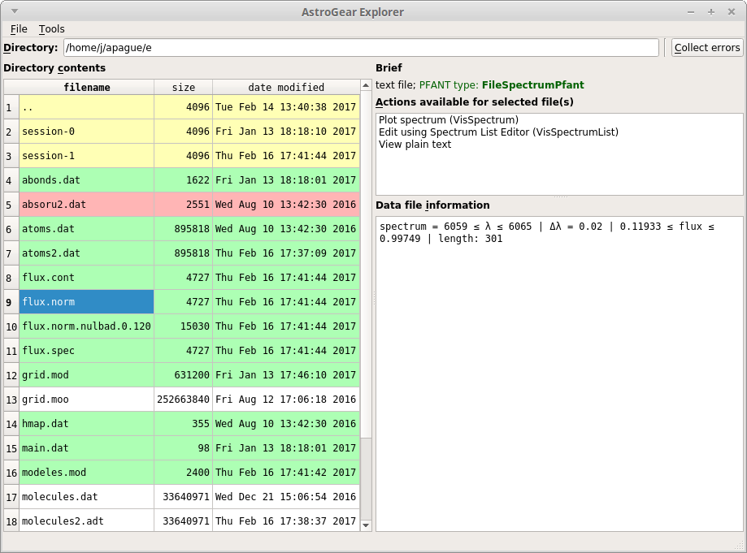
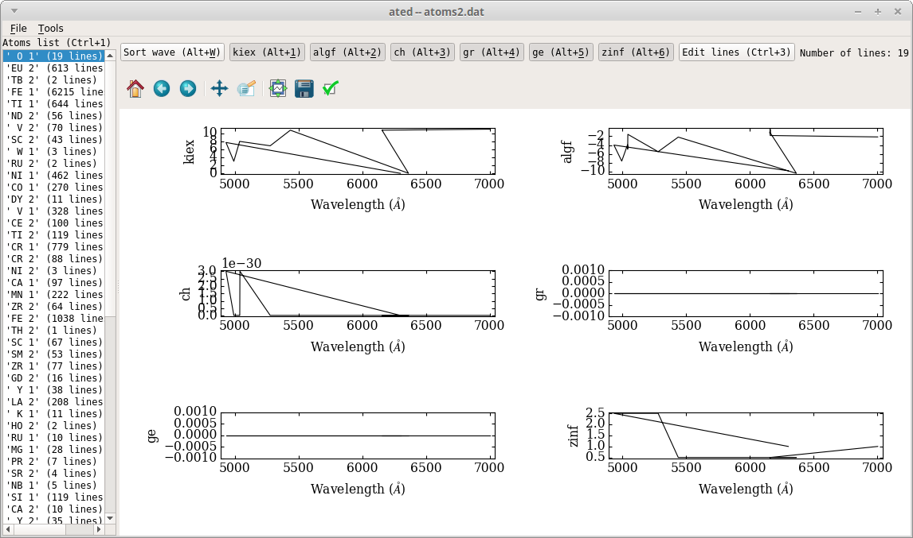

More GUI
========

Editing input data files
------------------------

Edit stellar parameters and abundances
~~~~~~~~~~~~~~~~~~~~~~~~~~~~~~~~~~~~~~

.. todo:: explain that these files can be edited using mained.py, abed.py or also in x.py

Browse files with F311 Explorer
~~~~~~~~~~~~~~~~~~~~~~~~~~~~~~~~~

This application (:numref:`figexplorer`) allows you to navigate through your file system and
visualize/edit files of various files, including spectra and most files used by PFANT.
A list with all supported file types is
available `here <...>`__

.. code:: shell

    explorer.py

.. _figexplorer:

    -- ``explorer.py`` screenshot.

.. todo:: summarize file types and their editors

You can select several spectral files and plot them all at once
(stacked in different sub-plots, or overlapped in a single plot).

Edit Atomic Lines file
~~~~~~~~~~~~~~~~~~~~~~

First make a copy of file "atoms.dat" to leave the current one
untouched.

.. code:: shell

    copy atoms.dat atoms2.dat

Now open the Atomic Lines Editor (:numref:`figated`):

.. code:: shell

    ated.py atoms2.dat

.. _figated:

    -- ``ated.py`` screenshot.

Edit Molecular Lines file
~~~~~~~~~~~~~~~~~~~~~~~~~

First make a copy of file "molecules.dat" to leave the current one
untouched.

.. code:: shell

    copy molecules.dat molecules2.dat

Now open the Molecular Lines Editor (:numref:`figmled`):

.. code:: shell

    mled.py molecules2.dat

.. _figmled:

.. figure:: img/mled.png
    :align: center

    -- ``mled.png`` screenshot.
