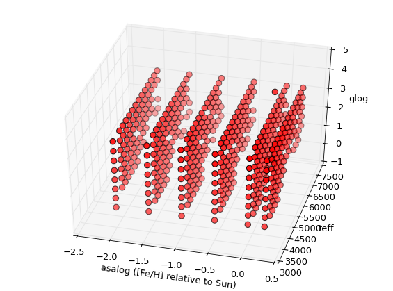
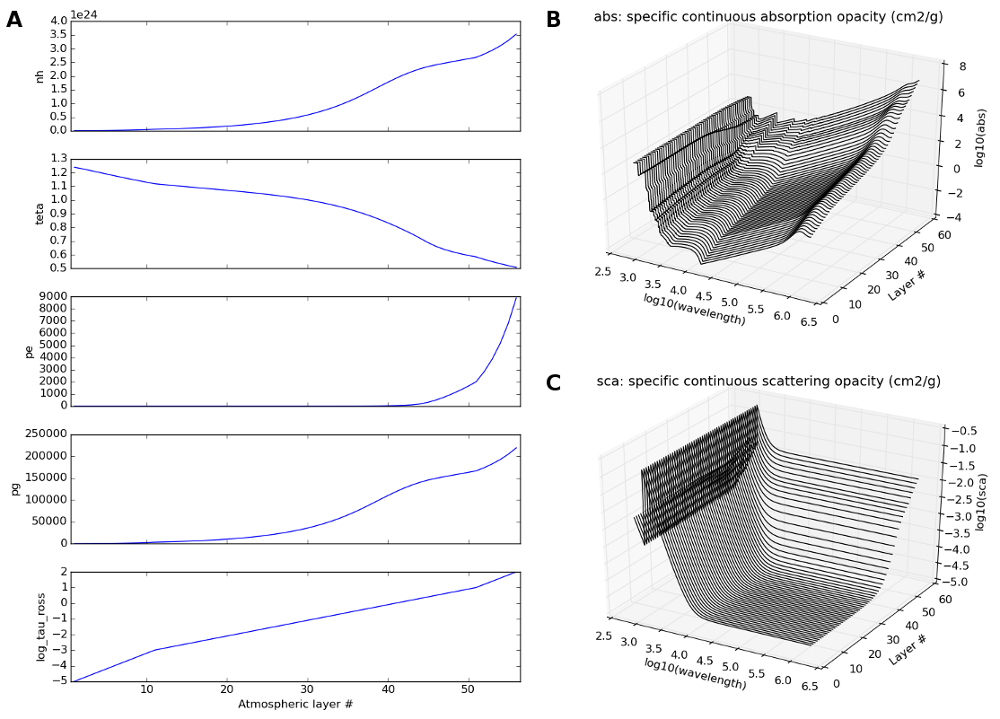
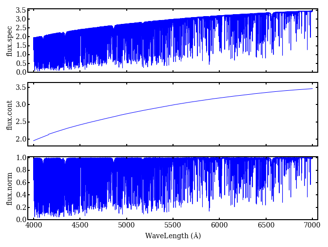

Reference
=========

This section contains a more complete description of the PFANT pipeline
and the files and file types involved.

Spectral synthesis pipeline
---------------------------

::

                        +---------------------------+---------------------main.dat
                        |                           |                        |
                        v                           v  (H lines)             |
     grid.mod     +----------+                  +------+                     |
          or ---->|innewmarcs|-->modeles.mod--->|hydro2|<----------+         |
     grid.moo     +----------+         |        +------+           |         |
                  (interpolate         |            |              |         |
                   atm. model)         |            v              |         |
                                       |         thalpha           |         |
                                       |         thbeta        absoru2.dat   |
                                       |         thgamma       hmap.dat      |
                                       |         thdelta           |         |
                                       |         thepsilon         |         |
                                       |            |              |         |
                        abonds.dat     |            v              |         |
                        dissoc.dat     +-------->+-----+           |         |
                         atoms.dat    (synthesis)|pfant|<----------+         |
                     molecules.dat ------------->+-----+<--------------------+
                        partit.dat                  |                        |
                                                    v                        |
                                                flux.norm                    |
                                                flux.spec                    |
                                                flux.cont                    |
                                                    |                        |
                                                    v                        |
                                                 +------+                    |
                             (convolve spectrum) |nulbad|<-------------------+
                                                 +------+
                                                    |
                                                    v
                                             flux.norm.nulbad.<fwhm>

Figure 5 - Spectral synthesis pipeline - Fortran programs (boxes) and
their input/output files (see Figure 2 for extended description of modules).

Input/output data files
-----------------------

The different file types in the pipeline will be explained in the next
subsections.

Stellar data and running settings
~~~~~~~~~~~~~~~~~~~~~~~~~~~~~~~~~

Table 2 -- stellar and running settings data files. The "--options" column shows the command-line
options that can be used to change the name for a particular file, *e.g.*,
``run4.py --fn_main main-other.dat``.

+----------------+---------------+---------------------------------------------------------------------------------------------------------+
| Default name   | --option      | Description                                                                                             |
+================+===============+=========================================================================================================+
| *main.dat*     | --fn_main     | main configuration file containing all stellar parameters except abundances                             |
+----------------+---------------+---------------------------------------------------------------------------------------------------------+
| *abonds.dat*   | --fn_abonds   | chemical abundances                                                                                     |
+----------------+---------------+---------------------------------------------------------------------------------------------------------+
| *dissoc.dat*   | --fn_dissoc   | dissociation equilibrium data. This file is optional, and can be created using ``abed.py`` if needed    |
+----------------+---------------+---------------------------------------------------------------------------------------------------------+

Common data files
~~~~~~~~~~~~~~~~~

Table 3 -- Common data files.

.. todo:: fix table

+----------------+----------------+-----------------------------------------------------------------+
| Default name   | --option       | Description                                                     |
+================+================+=================================================================+
| absoru2.dat    | --fn_absoru2   | absorption info for continuum calculation.                      |
+----------------+----------------+-----------------------------------------------------------------+
| atoms.dat      | --fn_atoms     | atomic line list                                                |
+----------------+----------------+-----------------------------------------------------------------+
| molecules.dat  | --fn_molecules | molecular line list                                             |
+----------------+----------------+-----------------------------------------------------------------+
| hmap.dat       | --fn_hmap      | hydrogen line list                                              |
+----------------+----------------+-----------------------------------------------------------------+
| partit.dat     | --fn_partit    | partition functions                                             |
+----------------+----------------+-----------------------------------------------------------------+
| grid.mod or    | --fn_modgrid   | MARCS atmospheric model grid (models only).                     |
+----------------+----------------+-----------------------------------------------------------------+
|  grid.moo      | --fn_moo       | MARCS atmospheric model grid (models with opacities) (Figure 8).|
+----------------+----------------+-----------------------------------------------------------------+

|image11|

Figure 7 -- 3D grid of atmospheric models. The scatterplot in the figure shows the
(teff, glog, [Fe/H]) values for all existing atmospheric models in the grid (this is the
file *grid.moo* provided). The uppermost point are the Sun coordinates.

Files created by the Fortran programs
~~~~~~~~~~~~~~~~~~~~~~~~~~~~~~~~~~~~~

Files created by ``innewmarcs``
^^^^^^^^^^^^^^^^^^^^^^^^^^^^^^^

Table 4 -- Files created by ``innewmarcs``

+-----------------+---------------------+---------------------------------------------------------------------+
| Default name    | command-line option | Description                                                         |
+=================+=====================+=====================================================================+
|  modeles.mod    | --fn\_modeles       | atmospheric model (binary file) (Figure 8A)                         |
+-----------------+---------------------+---------------------------------------------------------------------+
|  modeles.opa    | --fn\_opa           | atmospheric model: opacities (MARCS ".opa" format) (Figure 8B,8C)   |
+-----------------+---------------------+---------------------------------------------------------------------+

|image12|

Figure 8 -- Atmospheric model information (Sun). **(A)** data in file modeles.mod;
**(B)**, **(C)** data in modeles.opa

``innewmarcs`` creates two separate files (Table 4). They are created
separately for historical reasons. *modeles.opa* follows the same structure of ".opa"
files downloaded from the MARCS website. *modeles.mod* does **not** follow the same
structure of MARCS ".mod" files. Figure 8 illustrates the information contained in these files.

Files created by ``hydro2``
^^^^^^^^^^^^^^^^^^^^^^^^^^^

``hydro2`` creates a series of files named "thalha" (Figure 9),
"thbeta", "thgamma", "thdelta", "thepsilon" etc. (the series of hydrogen lines is given in
file "hmap.dat").

|image13|

Figure 9 -- Example of H-alpha line profile calculated by ``hydro2``.

Files created by ``pfant``
^^^^^^^^^^^^^^^^^^^^^^^^^^

Table 5 - Files created by ``pfant``

+----------------+-------------------------------------------------------------+
| Default name   | Description                                                 |
+================+=============================================================+
|  flux.spec     | un-normalized flux (erg/cm**2/s/Hz multiplied by 10**\ 5)   |
+----------------+-------------------------------------------------------------+
|  flux.cont     | continuum flux (erg/cm**2/s/Hz multiplied by 10**\ 5)       |
+----------------+-------------------------------------------------------------+
|  flux.norm     | normalized flux (un-normalized flux)/(continuum flux)       |
+----------------+-------------------------------------------------------------+

|image14|

Figure 10 - plots showing three ``pfant`` output files for the [4000, 7000] angstrom region:
calculated spectrum; continuum; normalized spectrum. The common prefix "flux" can be changed
in file "main.dat" to give a set of files with different names.

Files created by ``nulbad``
^^^^^^^^^^^^^^^^^^^^^^^^^^^

``nulbad`` creates a file whose name by default is the full input file name with the FWHM
added with three decimal places. For example,

.. code:: shell

    nulbad --fwhm 1.2

creates a file named "flux.norm.nulbad.1.200".

To change this, use option "--fn\_cv", for example,

.. code:: shell

    nulbad --fwhm 1.2 --fn_cv another-name

.. |image10| image:: img/small-main.dat.png

.. |image13| image:: img/thalpha.png

.. todo:: Another page containing the visual maps of the text files, such as main.dat