# ```pyfant``` GUI screenshots


## Main configuration 
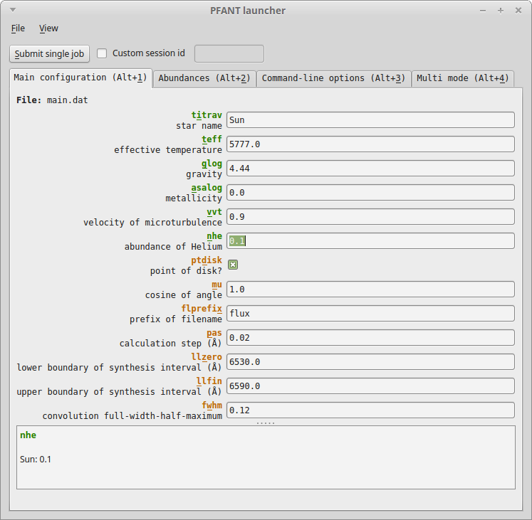

## Chemical abundances 
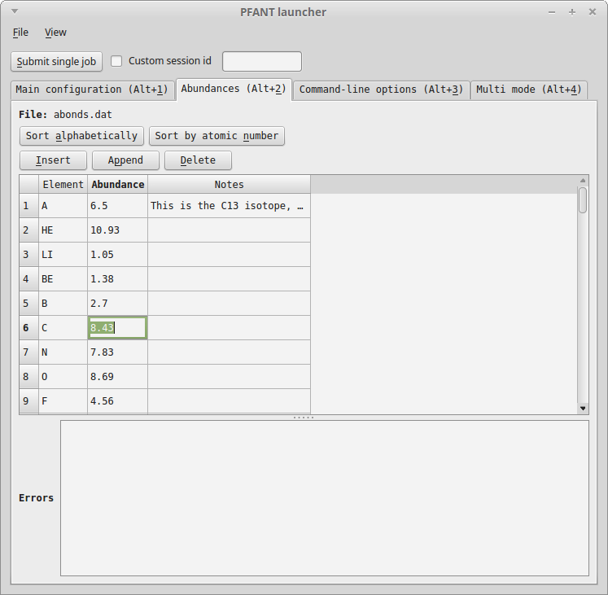

## Command-line options  
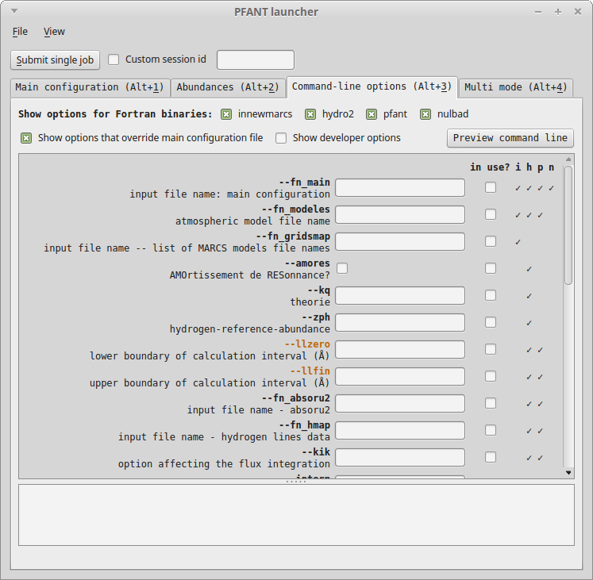

## "Multi mode" (differential abundances _versus_ convolution FWHM's)
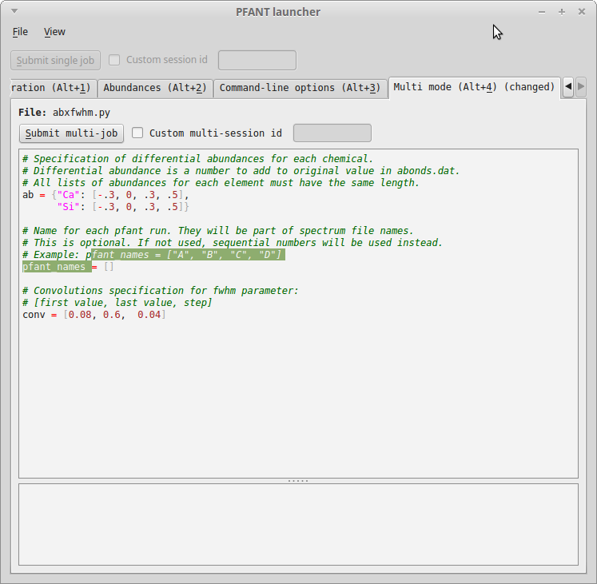

## Runnables Manager -- Several jobs running in parallel
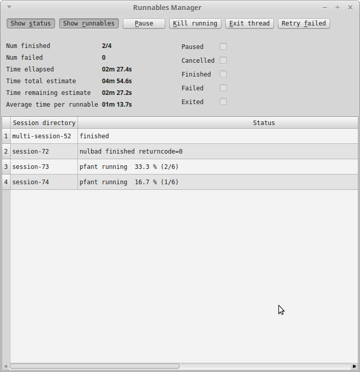

## File Explorer
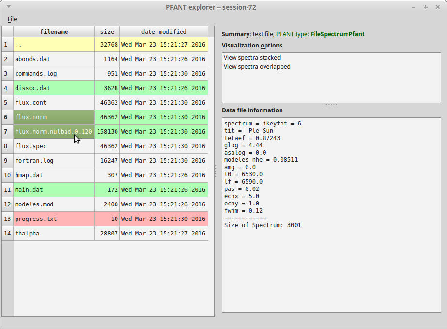

## Two spectra (before and after convolution)
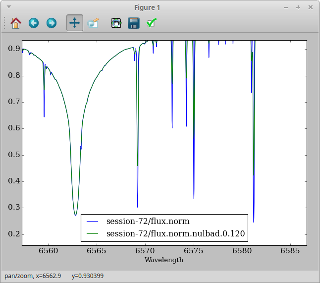

## Hydrogen line -- H-alpha
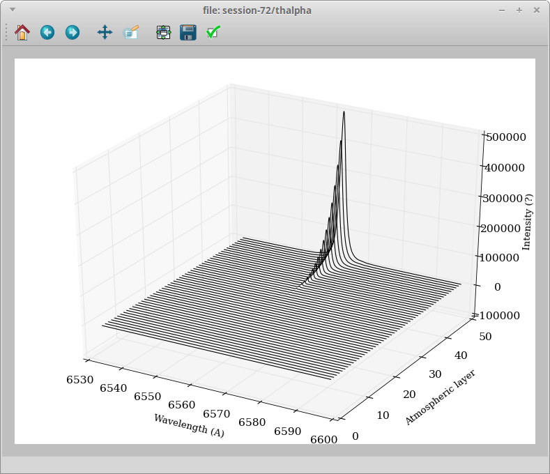

## Comparison between several convolutions (result of "multi mode")
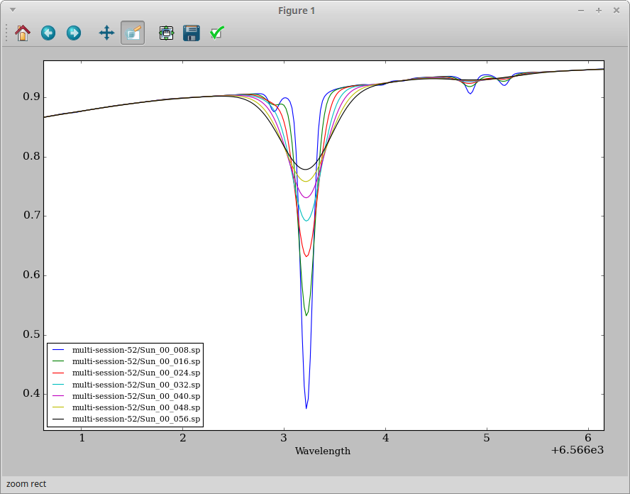

## Atomic lines editor
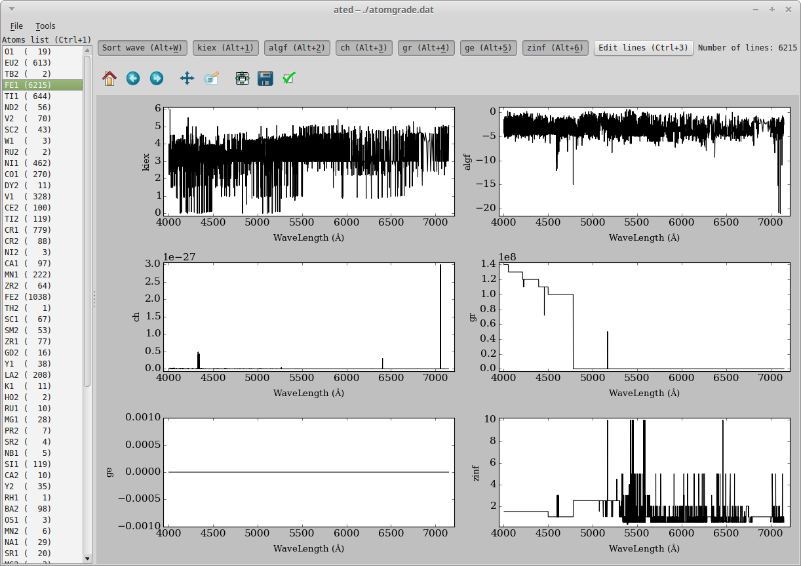

## Molecular lines editor
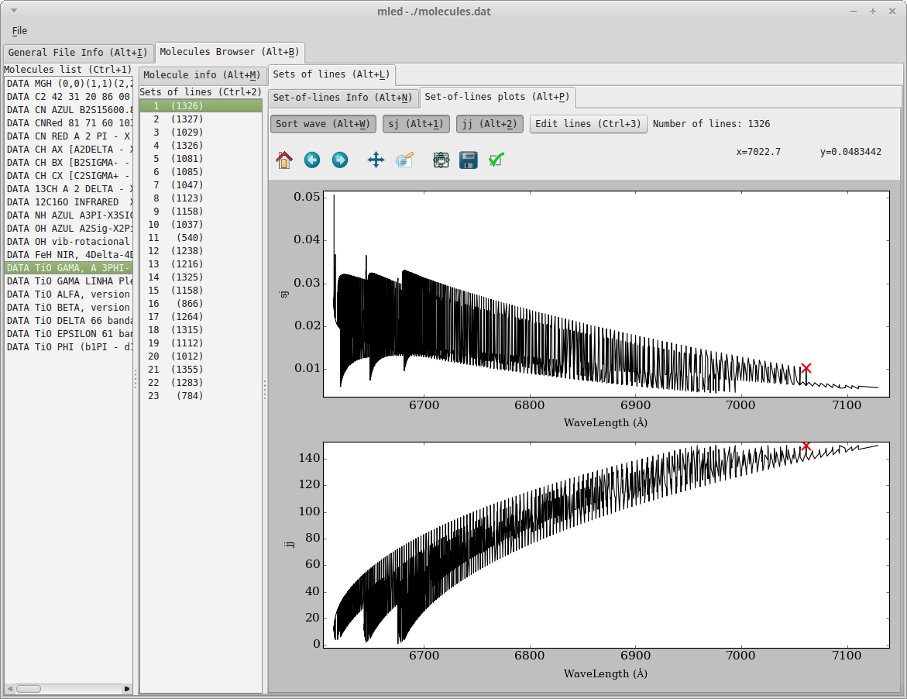


